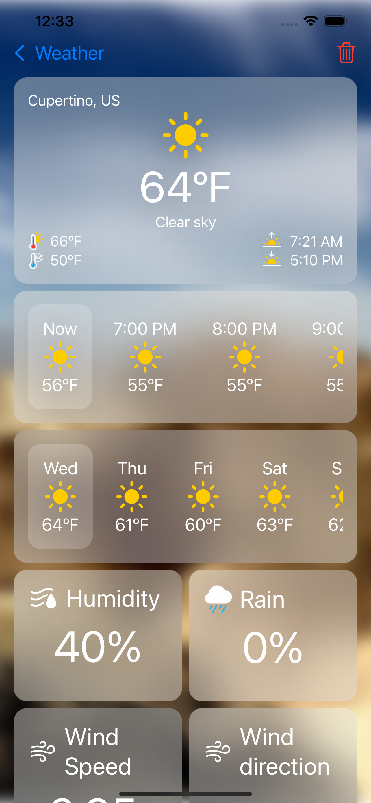

# Weather ☁️
A simple weather app that pulls data from [OpenWeatherMap](openweathermap.org)

### TODO:
- [x] Get pictures from unsplashed
- [ ] Add hourly temperature data
- [x] Get weekly temperature data
- [ ] Update UI

### Current progress
|  |  |
|---|---|
|||

